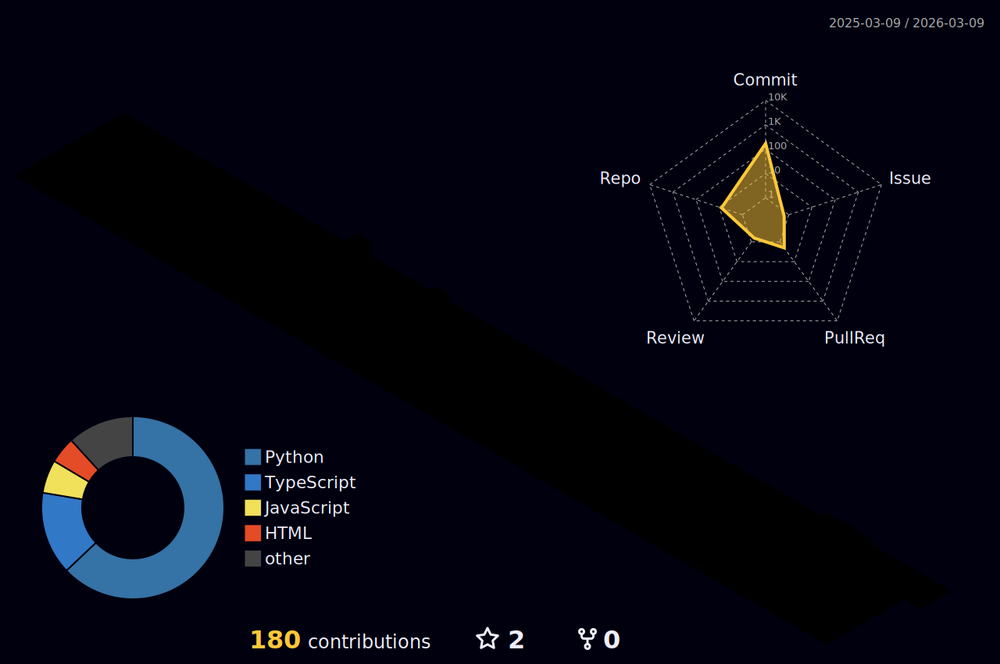

<!-- Header -->
<div align="center">
  <picture>
    <source media="(prefers-color-scheme: dark)" srcset="./assets/icons/user-light.svg">
    <source media="(prefers-color-scheme: light)" srcset="./assets/icons/user-dark.svg">
    
  </picture>
  <br/><br/>
  <a href="https://git.io/typing-svg">
    
  </a>
  <br/>
  <sub>Designer + AI-Assisted Developer</sub>
</div>

<br/>

<!-- Pixel Divider -->
<div align="center">
  <picture>
    <source media="(prefers-color-scheme: dark)" srcset="./assets/icons/chevrons-horizontal-light.svg">
    <source media="(prefers-color-scheme: light)" srcset="./assets/icons/chevrons-horizontal-dark.svg">
    
  </picture>
  <picture>
    <source media="(prefers-color-scheme: dark)" srcset="./assets/icons/chevrons-horizontal-light.svg">
    <source media="(prefers-color-scheme: light)" srcset="./assets/icons/chevrons-horizontal-dark.svg">
    
  </picture>
  <picture>
    <source media="(prefers-color-scheme: dark)" srcset="./assets/icons/chevrons-horizontal-light.svg">
    <source media="(prefers-color-scheme: light)" srcset="./assets/icons/chevrons-horizontal-dark.svg">
    
  </picture>
</div>

<br/>

<div align="center">
  
</div>

```
+----------------------------------+
|  name: 2rami                     |
|  location: South Korea           |
|  background: Design Student      |
|  focus: AI-Assisted Development  |
+----------------------------------+
|  interests:                      |
|    > Discord Bot Development     |
|    > Automation Scripts          |
|    > Game Development            |
+----------------------------------+
```

<br/>

<!-- Pixel Divider -->
<div align="center">
  <picture>
    <source media="(prefers-color-scheme: dark)" srcset="./assets/icons/chevrons-horizontal-light.svg">
    <source media="(prefers-color-scheme: light)" srcset="./assets/icons/chevrons-horizontal-dark.svg">
    
  </picture>
  <picture>
    <source media="(prefers-color-scheme: dark)" srcset="./assets/icons/chevrons-horizontal-light.svg">
    <source media="(prefers-color-scheme: light)" srcset="./assets/icons/chevrons-horizontal-dark.svg">
    
  </picture>
  <picture>
    <source media="(prefers-color-scheme: dark)" srcset="./assets/icons/chevrons-horizontal-light.svg">
    <source media="(prefers-color-scheme: light)" srcset="./assets/icons/chevrons-horizontal-dark.svg">
    
  </picture>
</div>

<br/>

<div align="center">
  
</div>

<div align="center">

### Development
<picture>
  <source media="(prefers-color-scheme: dark)" srcset="./assets/icons/code-light.svg">
  <source media="(prefers-color-scheme: light)" srcset="./assets/icons/code-dark.svg">
  
</picture>
<picture>
  <source media="(prefers-color-scheme: dark)" srcset="./assets/icons/script-light.svg">
  <source media="(prefers-color-scheme: light)" srcset="./assets/icons/script-dark.svg">
  
</picture>
<picture>
  <source media="(prefers-color-scheme: dark)" srcset="./assets/icons/message-processing-light.svg">
  <source media="(prefers-color-scheme: light)" srcset="./assets/icons/message-processing-dark.svg">
  
</picture>
<picture>
  <source media="(prefers-color-scheme: dark)" srcset="./assets/icons/server-light.svg">
  <source media="(prefers-color-scheme: light)" srcset="./assets/icons/server-dark.svg">
  
</picture>
<br/>
<sub>Python | JavaScript | Discord.py | FastAPI</sub>

<br/><br/>

### AI Tools
<picture>
  <source media="(prefers-color-scheme: dark)" srcset="./assets/icons/chat-light.svg">
  <source media="(prefers-color-scheme: light)" srcset="./assets/icons/chat-dark.svg">
  
</picture>
<picture>
  <source media="(prefers-color-scheme: dark)" srcset="./assets/icons/message-processing-light.svg">
  <source media="(prefers-color-scheme: light)" srcset="./assets/icons/message-processing-dark.svg">
  
</picture>
<picture>
  <source media="(prefers-color-scheme: dark)" srcset="./assets/icons/zap-light.svg">
  <source media="(prefers-color-scheme: light)" srcset="./assets/icons/zap-dark.svg">
  
</picture>
<br/>
<sub>Claude | ChatGPT | GitHub Copilot</sub>

<br/><br/>

### Design
<picture>
  <source media="(prefers-color-scheme: dark)" srcset="./assets/icons/paint-bucket-light.svg">
  <source media="(prefers-color-scheme: light)" srcset="./assets/icons/paint-bucket-dark.svg">
  
</picture>
<picture>
  <source media="(prefers-color-scheme: dark)" srcset="./assets/icons/image-light.svg">
  <source media="(prefers-color-scheme: light)" srcset="./assets/icons/image-dark.svg">
  
</picture>
<picture>
  <source media="(prefers-color-scheme: dark)" srcset="./assets/icons/edit-box-light.svg">
  <source media="(prefers-color-scheme: light)" srcset="./assets/icons/edit-box-dark.svg">
  
</picture>
<picture>
  <source media="(prefers-color-scheme: dark)" srcset="./assets/icons/layout-light.svg">
  <source media="(prefers-color-scheme: light)" srcset="./assets/icons/layout-dark.svg">
  
</picture>
<br/>
<sub>Figma | Photoshop | Illustrator | Adobe XD</sub>

<br/><br/>

### Tools
<picture>
  <source media="(prefers-color-scheme: dark)" srcset="./assets/icons/git-branch-light.svg">
  <source media="(prefers-color-scheme: light)" srcset="./assets/icons/git-branch-dark.svg">
  
</picture>
<picture>
  <source media="(prefers-color-scheme: dark)" srcset="./assets/icons/git-merge-light.svg">
  <source media="(prefers-color-scheme: light)" srcset="./assets/icons/git-merge-dark.svg">
  
</picture>
<picture>
  <source media="(prefers-color-scheme: dark)" srcset="./assets/icons/code-light.svg">
  <source media="(prefers-color-scheme: light)" srcset="./assets/icons/code-dark.svg">
  
</picture>
<br/>
<sub>Git | GitHub | VSCode</sub>

</div>

<br/>

<!-- Pixel Divider -->
<div align="center">
  <picture>
    <source media="(prefers-color-scheme: dark)" srcset="./assets/icons/chevrons-horizontal-light.svg">
    <source media="(prefers-color-scheme: light)" srcset="./assets/icons/chevrons-horizontal-dark.svg">
    
  </picture>
  <picture>
    <source media="(prefers-color-scheme: dark)" srcset="./assets/icons/chevrons-horizontal-light.svg">
    <source media="(prefers-color-scheme: light)" srcset="./assets/icons/chevrons-horizontal-dark.svg">
    
  </picture>
  <picture>
    <source media="(prefers-color-scheme: dark)" srcset="./assets/icons/chevrons-horizontal-light.svg">
    <source media="(prefers-color-scheme: light)" srcset="./assets/icons/chevrons-horizontal-dark.svg">
    
  </picture>
</div>

<div align="center">
  
</div>

<div align="center">
  
  
</div>

<br/>

<!-- Pixel Divider -->
<div align="center">
  <picture>
    <source media="(prefers-color-scheme: dark)" srcset="./assets/icons/chevrons-horizontal-light.svg">
    <source media="(prefers-color-scheme: light)" srcset="./assets/icons/chevrons-horizontal-dark.svg">
    
  </picture>
  <picture>
    <source media="(prefers-color-scheme: dark)" srcset="./assets/icons/chevrons-horizontal-light.svg">
    <source media="(prefers-color-scheme: light)" srcset="./assets/icons/chevrons-horizontal-dark.svg">
    
  </picture>
  <picture>
    <source media="(prefers-color-scheme: dark)" srcset="./assets/icons/chevrons-horizontal-light.svg">
    <source media="(prefers-color-scheme: light)" srcset="./assets/icons/chevrons-horizontal-dark.svg">
    
  </picture>
</div>

<br/>

<div align="center">
  
</div>

<div align="center">
  
</div>

<br/>

<!-- Pixel Divider -->
<div align="center">
  <picture>
    <source media="(prefers-color-scheme: dark)" srcset="./assets/icons/chevrons-horizontal-light.svg">
    <source media="(prefers-color-scheme: light)" srcset="./assets/icons/chevrons-horizontal-dark.svg">
    
  </picture>
  <picture>
    <source media="(prefers-color-scheme: dark)" srcset="./assets/icons/chevrons-horizontal-light.svg">
    <source media="(prefers-color-scheme: light)" srcset="./assets/icons/chevrons-horizontal-dark.svg">
    
  </picture>
  <picture>
    <source media="(prefers-color-scheme: dark)" srcset="./assets/icons/chevrons-horizontal-light.svg">
    <source media="(prefers-color-scheme: light)" srcset="./assets/icons/chevrons-horizontal-dark.svg">
    
  </picture>
</div>

<br/>

<div align="center">
  
</div>

<div align="center">
  <a href="https://github.com/2rami/debi-marlene">
    
  </a>
</div>

<br/>

<!-- Pixel Divider -->
<div align="center">
  <picture>
    <source media="(prefers-color-scheme: dark)" srcset="./assets/icons/chevrons-horizontal-light.svg">
    <source media="(prefers-color-scheme: light)" srcset="./assets/icons/chevrons-horizontal-dark.svg">
    
  </picture>
  <picture>
    <source media="(prefers-color-scheme: dark)" srcset="./assets/icons/chevrons-horizontal-light.svg">
    <source media="(prefers-color-scheme: light)" srcset="./assets/icons/chevrons-horizontal-dark.svg">
    
  </picture>
  <picture>
    <source media="(prefers-color-scheme: dark)" srcset="./assets/icons/chevrons-horizontal-light.svg">
    <source media="(prefers-color-scheme: light)" srcset="./assets/icons/chevrons-horizontal-dark.svg">
    
  </picture>
</div>

<br/>

<div align="center">
  
</div>

<div align="center">
  <picture>
    <source media="(prefers-color-scheme: dark)" srcset="./assets/icons/message-light.svg">
    <source media="(prefers-color-scheme: light)" srcset="./assets/icons/message-dark.svg">
    
  </picture>
  <picture>
    <source media="(prefers-color-scheme: dark)" srcset="./assets/icons/git-branch-light.svg">
    <source media="(prefers-color-scheme: light)" srcset="./assets/icons/git-branch-dark.svg">
    
  </picture>
  <br/>
  <sub>Discord: @omufrozen | GitHub: 2rami</sub>
</div>

<br/>

<!-- Pixel Footer -->
<div align="center">
  <picture>
    <source media="(prefers-color-scheme: dark)" srcset="./assets/icons/chevron-down-light.svg">
    <source media="(prefers-color-scheme: light)" srcset="./assets/icons/chevron-down-dark.svg">
    
  </picture>
  <picture>
    <source media="(prefers-color-scheme: dark)" srcset="./assets/icons/heart-light.svg">
    <source media="(prefers-color-scheme: light)" srcset="./assets/icons/heart-dark.svg">
    
  </picture>
  <picture>
    <source media="(prefers-color-scheme: dark)" srcset="./assets/icons/chevron-down-light.svg">
    <source media="(prefers-color-scheme: light)" srcset="./assets/icons/chevron-down-dark.svg">
    
  </picture>
</div>
