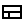
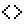
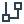
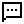

<!-- ═══════════════ HERO ═══════════════ -->


<pre>
    Designer + AI-Assisted Developer
    South Korea

    Building a terminal, discord bots, slack agents and games
    Design student who codes with Claude
</pre>

```json
{
  "focus":    "AI-Assisted Development",
  "building": ["terminal", "discord bots", "slack agents", "games"],
  "tools":    ["Claude Code", "Figma", "Rust", "Python"]
}
```


---

<!-- ═══════════════ WHAT I BUILD ═══════════════ -->
<picture>
  <source media="(prefers-color-scheme: dark)" srcset="./assets/icons-anim/layout-light.svg">
  
</picture>

### &nbsp;What I Build

<a href="https://github.com/2rami/kasaterm"></a>
<a href="https://github.com/2rami/debi-marlene"></a>
<a href="https://github.com/2rami/nacho-neko"></a>
<a href="https://github.com/2rami/now-there"></a>
<a href="https://github.com/2rami/claude-code-simple-statusline"></a>
<a href="https://github.com/2rami/ai-trending-feed"></a>

---

<!-- ═══════════════ TECH ═══════════════ -->
<picture>
  <source media="(prefers-color-scheme: dark)" srcset="./assets/icons-anim/code-light.svg">
  
</picture>

### &nbsp;Tech Stack


---

<!-- ═══════════════ CONTRIBUTION ═══════════════ -->
<picture>
  <source media="(prefers-color-scheme: dark)" srcset="./assets/icons-anim/git-branch-light.svg">
  
</picture>

### &nbsp;Contribution


---


<!-- ═══════════════ CONNECT ═══════════════ -->
<picture>
  <source media="(prefers-color-scheme: dark)" srcset="./assets/icons-anim/message-processing-light.svg">
  
</picture>

### &nbsp;Connect

<a href="https://discord.com/users/omufrozen"></a>
<a href="mailto:goenho0613@gmail.com"></a>
<a href="https://github.com/2rami"></a>
