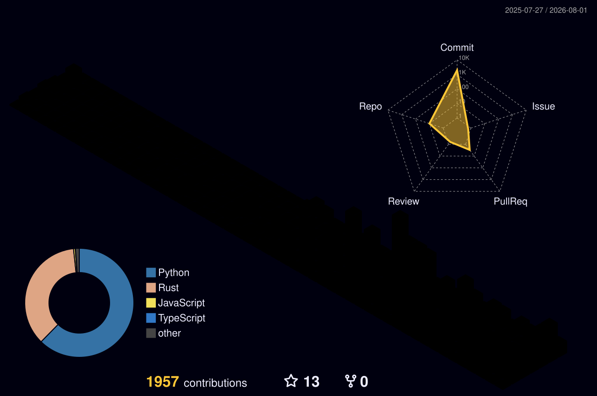

<!-- Header -->
<div align="center">
  <picture>
    <source media="(prefers-color-scheme: dark)" srcset="./assets/icons/user-light.svg">
    
  </picture>
  <br/><br/>
  <a href="https://git.io/typing-svg">
    
  </a>
  <br/>
  <sub>Designer + AI-Assisted Developer</sub>
  <br/><br/>
  <picture>
    <source media="(prefers-color-scheme: dark)" srcset="./assets/icons/chevrons-horizontal-light.svg">
    
  </picture>
</div>

<br/>

---

<br/>

<!-- About Me -->
<div align="center">
  <picture>
    <source media="(prefers-color-scheme: dark)" srcset="./assets/icons/chat-light.svg">
    
  </picture>
  &nbsp;
  
</div>

```yaml
name: 2rami
location: South Korea
background: Design Student
current_focus: AI-Assisted Development
interests:
  - Discord Bot Development
  - Automation Scripts
  - Game Development
```

<br/>

---

<br/>

<!-- Tech Stack -->
<div align="center">
  <picture>
    <source media="(prefers-color-scheme: dark)" srcset="./assets/icons/code-light.svg">
    
  </picture>
  &nbsp;
  
</div>

<div align="center">

### Development & AI Tools


### Design & Tools


</div>

<br/>

---

<br/>

<!-- What I Build -->
<div align="center">
  <picture>
    <source media="(prefers-color-scheme: dark)" srcset="./assets/icons/layout-light.svg">
    
  </picture>
  &nbsp;
  
</div>

<div align="center">
<table>
  <tr>
    <td align="center" width="25%">
      <picture>
        <source media="(prefers-color-scheme: dark)" srcset="./assets/icons/server-light.svg">
        
      </picture>
      <br/><b>Bots</b><br/>
      <sub>
        <a href="https://github.com/2rami/debi-marlene">debi-marlene</a><br/>
        <a href="https://github.com/2rami/nacho-neko">nacho-neko</a><br/>
        <a href="https://github.com/2rami/ai-trending-feed">ai-trending-feed</a>
      </sub>
    </td>
    <td align="center" width="25%">
      <picture>
        <source media="(prefers-color-scheme: dark)" srcset="./assets/icons/device-laptop-light.svg">
        
      </picture>
      <br/><b>Tools</b><br/>
      <sub>
        <a href="https://github.com/2rami/kasaterm">kasaterm</a><br/>
        <a href="https://github.com/2rami/claude-code-simple-statusline">statusline</a><br/>
        <a href="https://github.com/2rami/dotfiles">dotfiles</a>
      </sub>
    </td>
    <td align="center" width="25%">
      <picture>
        <source media="(prefers-color-scheme: dark)" srcset="./assets/icons/paint-bucket-light.svg">
        
      </picture>
      <br/><b>Web &amp; Design</b><br/>
      <sub>
        <a href="https://github.com/2rami/sema-reimagined-gallery">sema-gallery</a><br/>
        <a href="https://github.com/2rami/Websiteredesignwiththreejs">threejs-redesign</a><br/>
        <a href="https://github.com/2rami/Asciiviewer">Asciiviewer</a>
      </sub>
    </td>
    <td align="center" width="25%">
      <picture>
        <source media="(prefers-color-scheme: dark)" srcset="./assets/icons/gamepad-light.svg">
        
      </picture>
      <br/><b>Games</b><br/>
      <sub>
        <a href="https://github.com/2rami/perfectpixel-studio">perfectpixel-studio</a><br/>
        <a href="https://github.com/2rami/debi-marlene">eternal-return bot</a>
      </sub>
    </td>
  </tr>
</table>
</div>

<br/>

---

<br/>

<!-- GitHub Stats -->
<div align="center">
  <picture>
    <source media="(prefers-color-scheme: dark)" srcset="./assets/icons/zap-light.svg">
    
  </picture>
  &nbsp;
  
</div>

<div align="center">
  
</div>

<br/>

---

<br/>

<!-- Streak -->
<div align="center">
  <picture>
    <source media="(prefers-color-scheme: dark)" srcset="./assets/icons/heart-light.svg">
    
  </picture>
  &nbsp;
  
</div>

<div align="center">
  
</div>

<br/>

---

<br/>

<!-- Contribution -->
<div align="center">
  <picture>
    <source media="(prefers-color-scheme: dark)" srcset="./assets/icons/git-branch-light.svg">
    
  </picture>
  &nbsp;
  
</div>

<div align="center">
  <picture>
    <source media="(prefers-color-scheme: dark)" srcset="https://raw.githubusercontent.com/2rami/2rami/output/github-contribution-grid-snake-dark.svg">
    
  </picture>
</div>

<br/>

<div align="center">
  <picture>
    <source media="(prefers-color-scheme: dark)" srcset="./assets/icons/git-merge-light.svg">
    
  </picture>
  <br/>
  
</div>

<br/>

---

<br/>

<!-- Featured Projects -->
<div align="center">
  <picture>
    <source media="(prefers-color-scheme: dark)" srcset="./assets/icons/command-light.svg">
    
  </picture>
  &nbsp;
  
</div>

<div align="center">
  <a href="https://github.com/2rami/kasaterm">
    
  </a>
  <a href="https://github.com/2rami/debi-marlene">
    
  </a>
</div>

<div align="center">
  <a href="https://github.com/2rami/now-there">
    
  </a>
  <a href="https://github.com/2rami/perfectpixel-studio">
    
  </a>
</div>

<br/>

---

<br/>

<!-- Currently Working On -->
<div align="center">
  <picture>
    <source media="(prefers-color-scheme: dark)" srcset="./assets/icons/edit-box-light.svg">
    
  </picture>
  &nbsp;
  
</div>

<div align="center">
<table>
  <tr>
    <td align="center" width="33%">
      <a href="https://github.com/2rami/kasaterm">
        
      </a>
      <br/>
      <sub>Rust GPU terminal built from scratch<br/>(wgpu + sugarloaf)</sub>
    </td>
    <td align="center" width="33%">
      <a href="https://github.com/2rami/debi-marlene">
        
      </a>
      <br/>
      <sub>AI voice / TTS pipeline<br/>for a Discord bot</sub>
    </td>
    <td align="center" width="33%">
      <a href="https://github.com/2rami/now-there">
        
      </a>
      <br/>
      <sub>Crowdsourced place-vibe app<br/>(Flutter)</sub>
    </td>
  </tr>
</table>
</div>

<br/>

---

<br/>

<!-- More -->
<div align="center">
  <picture>
    <source media="(prefers-color-scheme: dark)" srcset="./assets/icons/chevron-down-light.svg">
    
  </picture>
  &nbsp;
  
</div>

<div align="center">
<details>
<summary><b>Other repositories</b></summary>
<br/>
<table>
  <tr>
    <td align="center">
      <picture>
        <source media="(prefers-color-scheme: dark)" srcset="./assets/icons/script-light.svg">
        
      </picture>
      <br/><b>Config</b><br/>
      <sub>
        <a href="https://github.com/2rami/claude-config">claude-config</a><br/>
        <a href="https://github.com/2rami/memory-vault">memory-vault</a>
      </sub>
    </td>
    <td align="center">
      <picture>
        <source media="(prefers-color-scheme: dark)" srcset="./assets/icons/image-light.svg">
        
      </picture>
      <br/><b>Web</b><br/>
      <sub>
        <a href="https://github.com/2rami/sejongculture-pc">sejongculture-pc</a><br/>
        <a href="https://github.com/2rami/sabong-website">sabong-website</a>
      </sub>
    </td>
    <td align="center">
      <picture>
        <source media="(prefers-color-scheme: dark)" srcset="./assets/icons/message-light.svg">
        
      </picture>
      <br/><b>Panels</b><br/>
      <sub>
        <a href="https://github.com/2rami/debi-marlene-webpanel">debi-marlene-webpanel</a><br/>
        <a href="https://github.com/2rami/storm-assistant">storm-assistant</a>
      </sub>
    </td>
  </tr>
</table>
</details>
</div>

<br/>

---

<br/>

<!-- Connect -->
<div align="center">
  <picture>
    <source media="(prefers-color-scheme: dark)" srcset="./assets/icons/message-processing-light.svg">
    
  </picture>
  &nbsp;
  
</div>

<div align="center">

[](https://discord.com/users/omufrozen)
[](mailto:goenho0613@gmail.com)
[](https://github.com/2rami)

</div>

<br/>

<div align="center">
  <picture>
    <source media="(prefers-color-scheme: dark)" srcset="./assets/icons/chevrons-horizontal-light.svg">
    
  </picture>
</div>
