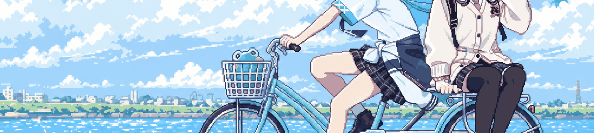
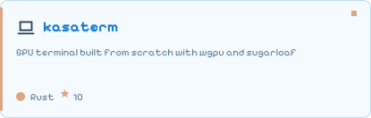
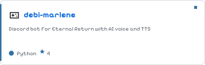
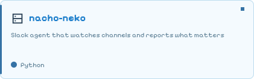
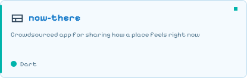
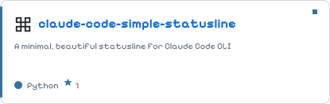
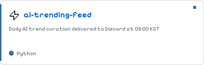

<!-- ═══════════════ HERO ═══════════════ -->



```json
{
  "now":      "kasaterm — a GPU terminal written in Rust",
  "learning": ["wgpu", "agent orchestration", "pixel art"],
  "ask_me":   ["terminal internals", "discord bots", "design systems"],
  "fun_fact": "every image on this page is drawn by a python script"
}
```



<!-- ═══════════════ WHAT I BUILD ═══════════════ -->


<a href="https://github.com/2rami/kasaterm"></a>
<a href="https://github.com/2rami/debi-marlene"></a>
<a href="https://github.com/2rami/nacho-neko"></a>
<a href="https://github.com/2rami/now-there"></a>
<a href="https://github.com/2rami/claude-code-simple-statusline"></a>
<a href="https://github.com/2rami/ai-trending-feed"></a>

<!-- ═══════════════ TECH ═══════════════ -->


<!-- ═══════════════ CONTRIBUTION ═══════════════ -->





<!-- ═══════════════ CONNECT ═══════════════ -->


<a href="https://discord.com/users/omufrozen"></a>
<a href="mailto:goenho0613@gmail.com"></a>
<a href="https://github.com/2rami"></a>
